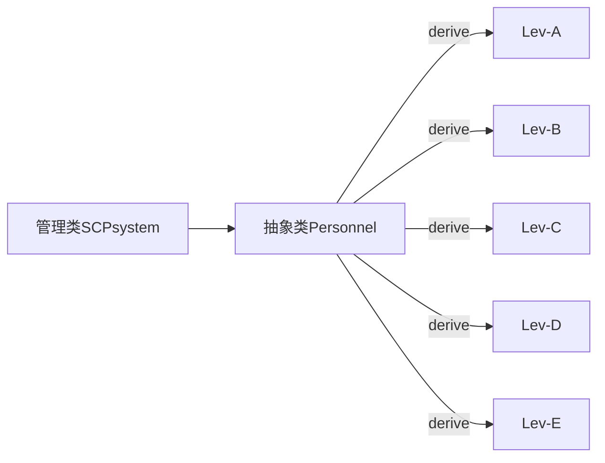

# SCP-Management-System
A normal university programming class task.
# 经典名单项目
## 说明
0. 这是个C++项目，主要是对**面向对象**的一个实践。
1. VS工程，所以粗一看居然多达49个文件。（留下了不会CMake的泪水）
2. 本来这是个存在我电脑里面的废弃项目，因为文件读写那一块基本上写崩了。不过管他呢，github也没说不收垃圾。
3. 如果真的有人能看到这个东西并且指点一二（求别骂，受不了），那我在这里先行道谢。**本当にありがとうございます！！**

一个可以提供交互的容器，它有许多名字，比如xx管理系统之类的，这里取形而上的名字：**名单**。

这里整个有意思一点的例子：SCP基金会人员名单。

本来就是萌新练练手的项目，不要太苛责啦。

要求实现的功能：

> 1. 经典**增删改查**
> 2. 写入文件，根据不同的情况给予不同的反应
> 3. 可以方便地删库跑路
> 4. 权限控制（登录系统）

基本架构是**继承-多态**，本来就是学生项目嘛。



## SCP system

管理类，就是整个系统的抽象。毕竟**一切皆对象**嘛。

`class SCPsystem`会实现要求的**所有功能**，其实也就是一程序的基本架构。

- 基本数据结构采用`STL::list`，我可不陪你自己写链表。
- **增删改查**就是把STL提供的功能包装成接口就行。
- 写入文件会在每次选择退出程序的时候发生。因为要在文件内部定位还是比较困难的，所以就采用**每次启动把数据全部读入到程序**的笨办法。因此每次退出都会销毁旧文件，创建新文件。
- 登录的实现机制是这样的：程序启动后读入数据，根据输入的**代号**，在库内查找到这个人，并且要求匹配的密码才能进入系统。再依据这个人的**权限等级**，开放不同的功能。


暂时还不用急着实现这个类，先去建立好数据类型。

## Personnel抽象类

**抽象类**，要负责找出所有的共性。

属性：

- 代号，`string`类，唯一登录依据。
- 名字，`string`类。
- 登录密匙，`string`类
- 等级，枚举类，ABCDEF
- 相关描述，`string`类

方法：

- 显示`print()`。

- 修改名字以及密匙`change_name(),change_password`。

- 不同的权限在不同子类方法重写中体现。

  实现：

  ```cpp
  class Personnel
  {
  public:
  	enum class Level { A, B, C, D, E };
  
  	Personnel(const string& ID, const string& name, Level lev, const string& password);
  	virtual ~Personnel() = 0;
  
  	virtual void print()const = 0;
  	virtual void change_name(const string& new_name) = 0;
  	virtual void change_password(const string& new_password) = 0;
  
  protected:
  	string ID;
  	string name;
  	Level lev;
  	string password;
  	ofstream overview;
  
  	string getLevelOverviewFileName(Level lev);
  };
  ```

  

## 派生类

派生类遵循统一的大结构，全部继承自`Personnel`。以后可以在不修改其他代码情况下根据需求拓展。

以下只详细描写`class A`。

### class A

注意，因为**基类没有默认构造函数**，所以子类构造函数必须**显式调用基类构造函数**。

不同分级人员权限不同，所以会编写不同的类方法。

```cpp
class AClass :
    public Personnel
{
public:
    AClass(const string& ID, const string& name, const string& password)
        :Personnel(ID,name,Level::A,password)//显式调用基类构造函数
    {}
    virtual void change_name(const string& new_name) { name = new_name; }
    virtual void change_password(const string& new_password) { password = new_password; }
};
```

在上述代码内，`virtual`也被一起复制过来。保留这个关键字可以允许你以后以A为基类派生更多类来拓展你的系统。

